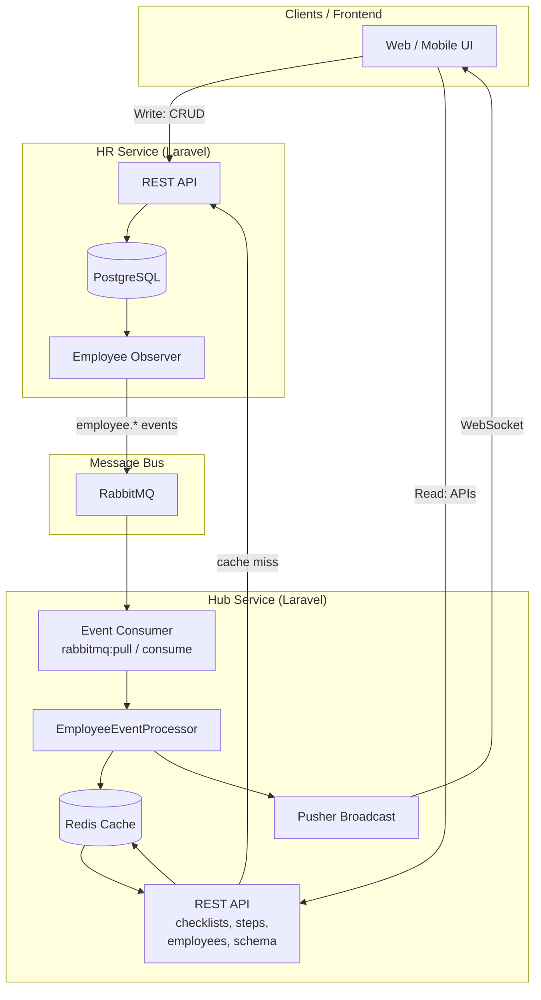

# Event-Driven Multi-Country HR Platform

**Innoscripta** – Senior Backend Engineer Challenge implementation.

---

## Section 1: Overview

### Brief description of the system

The platform is a **multi-country HR system** built as two Laravel microservices:

- **HR Service** – Source of truth for employee data. Exposes REST CRUD for employees and publishes domain events (EmployeeCreated, EmployeeUpdated, EmployeeDeleted) to RabbitMQ when data changes. Supports country-specific fields: **USA** (SSN, address), **Germany** (goal, tax_id).
- **Hub Service** – Central orchestration layer. It does not own data; it consumes events from RabbitMQ, caches data from the HR service, runs country-specific checklist validation, and exposes **server-driven UI APIs** (checklists, steps, employees, schema) and **real-time updates** via WebSockets (Pusher). Clients talk to the Hub for reads and real-time subscriptions; writes go to the HR service.

### Technology stack used

| Layer | Technology |
|-------|------------|
| Application | Laravel 12, PHP 8.2+ |
| HR database | PostgreSQL 16 |
| Message queue | RabbitMQ 3 (topic exchange `hr.events`, routing `employee.#`) |
| Cache | Redis 7 |
| Real-time | Pusher (WebSocket); optional Soketi for self-hosted |
| Orchestration | Docker Compose |

### Design decisions and trade-offs

| Decision | Rationale | Trade-off |
|----------|-----------|-----------|
| **Cache invalidation (not update-in-place) on events** | Keeps logic simple: on any employee change for a country, we invalidate checklist and employee caches for that country. No risk of stale partial updates. | Slightly more load on cache miss (re-fetch from HR), but reads are fast and HR is the single source of truth. |
| **Country-level and employee-level WebSocket channels** | Frontends can subscribe to `checklist.USA`, `employees.Germany`, or `employee.USA.123` so only relevant UIs get updates. | More channels to document; consistent naming is important. |
| **Pusher for real-time (no extra container)** | Reduces operational footprint; Pusher free tier is sufficient for the challenge. | Dependency on external service; for production self-hosted Soketi/Laravel WebSockets could be used. |
| **Hub never writes to HR’s database** | Hub only reads from HR via HTTP and manages its own cache. Writes and events stay in HR. | Clear ownership and no dual-write; HR remains the single source of truth. |
| **Form Requests + Resource classes for API** | Validation and response shaping live in dedicated classes; controllers stay thin. | More files, but consistent validation and response structure across endpoints. |

---

## Section 2: Architecture

### System architecture diagram



**ASCII version (no Mermaid):**

```
                    [Client]
                        |
        +---------------+---------------+
        |                               |
        v                               v
   HR Service                      Hub Service
   (REST CRUD)                     (REST: checklists, steps, employees, schema)
        |                               |
        v                               +---> Redis (cache)
   PostgreSQL                            |
        |                               +---> HR Service (on cache miss)
        v                                       |
   EmployeeObserver                             |
        |                                       v
        v                               [Response]
   RabbitMQ  <-------- employee.* events
        |
        v
   Hub Consumer (rabbitmq:pull or rabbitmq:consume-employee-events)
        |
        +---> EmployeeEventProcessor
        |         |
        |         +---> invalidate cache (Redis)
        |         +---> broadcast (Pusher)
        |
        v
   [Pusher] ------> [Client] (WebSocket)
```

### Data flow explanation

1. **Write path**
   - Client sends create/update/delete to **HR Service** REST API.
   - HR persists to **PostgreSQL** and, via **EmployeeObserver**, publishes a message to **RabbitMQ** (exchange `hr.events`, routing key e.g. `employee.created`).
   - HR does not wait for Hub; publishing is fire-and-forget (with try/catch and logging on failure).

2. **Event consumption (RabbitMQ → Hub)**
   - **Hub** consumes messages either via long-lived **`rabbitmq:consume-employee-events`** or one-off **`rabbitmq:pull`** (e.g. `make rabbitmq-pull-once`).
   - For each message, **EmployeeEventProcessor**:
     - Reads `event_type` and `country` from the payload.
     - **Invalidates cache**: removes `checklist:country:{country}` and all Redis keys matching `employees:{country}:*`.
     - **Broadcasts** via Pusher: `ChecklistUpdated` and `EmployeeDataUpdated` on channels `checklist.{country}` and `employees.{country}`.

3. **Read path (client → Hub APIs)**
   - Client calls Hub endpoints: `GET /api/checklists?country=`, `GET /api/steps?country=`, `GET /api/employees?country=&page=&per_page=`, `GET /api/schema/{step_id}?country=`.
   - **Checklist and employees**: Hub checks **Redis** first (cache-aside). On **cache hit**, returns cached JSON. On **cache miss**, fetches from **HR Service** (HTTP), computes/transforms (checklist rules, columns, SSN masking), stores in Redis with TTL, and returns the response.
   - **Steps and schema**: Config-driven (no cache); return country-specific steps and widget definitions, including `data_source` and `channel` for the frontend.

4. **Real-time updates**
   - Frontend subscribes to Pusher channels (e.g. `checklist.USA`, `employees.Germany`) using config from `GET /api/broadcasting/config`.
   - When Hub broadcasts after processing an event, the frontend receives it and can refetch the relevant API or update the UI.

---

## One-command start

From repo root:

```bash
docker compose up -d
# or: make up
```

| Service | URL |
|---------|-----|
| HR Service | http://localhost:8001 |
| Hub Service | http://localhost:9001 |
| RabbitMQ Management | http://localhost:15673 |
| WebSocket test page | http://localhost:9001/echo-test.html |
| Postman collection | [Import in Postman](https://www.postman.com/galactic-meteor-862086/workspace/innoscripts/collection/25427708-14c37558-7c53-4c6f-87ee-66b20eb76481?action=share&source=copy-link&creator=25427708) |

See **hub-service/README.md** and **hr-service/README.md** for API details, env vars, and run options.
